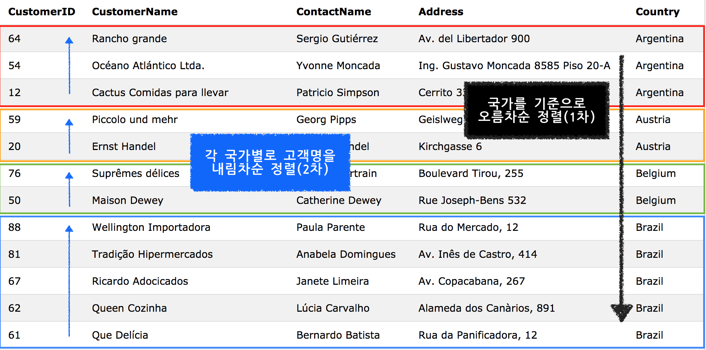
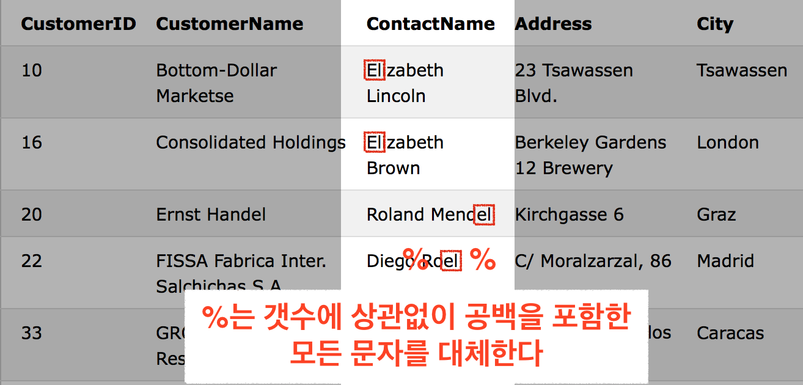
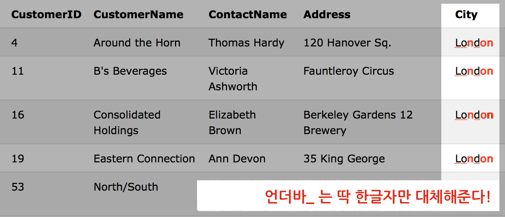

# SQL Tutorial 01

## Basic
Structured Query Language - 구조화된 질의 언어       
데이터베이스에 접근, 조작하게 해준다. 

w3c 표준  SQL이 있지만 아직 많은 데이터베이스 프로그램들이 각자 확장SQL을 사용하고 있다.


## SQL 구문(syntax)
### Database Tables
데이터베이스는 하나이상의 테이블을 갖고 있다. 데이터가 들어있는 테이블의 각 가로줄은 row 혹은 record라 하고 세로열은 column 이라 한다. column의 맨 윗줄에는 데이터의 분류를 표시한다. 

### SQL Statements
select 구문 실행해보기
`select * from Customers;`

### SQL은 대소문자 구분이 없다.
### SQL실행문 끝에는 세미콜론 `;`을 붙여주자.
### 중요한 명령어들
* SELECT - extracts data from a database	
* UPDATE - updates data in a database
* DELETE - deletes data from a database
* INSERT INTO - inserts new data into a database
* CREATE DATABASE - creates a new database
* ALTER DATABASE - modifies a database
* CREATE TABLE - creates a new table
* ALTER TABLE - modifies a table
* DROP TABLE - deletes a table
* CREATE INDEX - creates an index (search key)
* DROP INDEX - deletes an index

## SELECT
DB에서 데이터를 가져올때 실행하는 명령어이다. 
### 실행문
```SQL
SELECT column_name,column_name
FROM table_name;
```
컬럼명 대신 `*`을 넣으면 전체 컬럼을 선택한다.

## WHERE Clause
원하는 레코드만 선택하기위해 필터링 할때 사용한다. 
### 실행문
```
SELECT * FROM Customers 
WHERE Country='Mexico';
```
Customer 테이블에서 Country 컬럼의 값이 Mexico인 데이터만 선택하기 위한 구문이다. 

### 구문 작성시 문자값은 `'`으로 감싸주고 숫자값은 감싸주지 않아도 된다. 

### Where절 연산자
* `=`	Equal
* `<>`	Not equal. 
	* Note: In some versions of SQL this operator may be written as `!=`
* `>`	Greater than
* `<`	Less than
* `>=`	Greater than or equal
* `<=`	Less than or equal
* `BETWEEN`	값의 범위를 정해줄 때 
* `LIKE`	같은 패턴을 검색할 때
* `IN` 포함된 값을 찾을 때 


## AND, OR 연산자
조건에 만족하는 데이터를 선택할 때 사용한다. 
AND - 두 조건이 모두 true인 데이터만
OR - 한 조건만 true인 데이터면 무조건 

### AND실행문
```
SELECT * FROM Customers
WHERE Country='Germany'
AND City='Berlin';
```
Customers테이블에서 Country컬럼값이Germany이고  City컬럼값이 Berlin인 record 만 선택한다. 

### OR실행문
```
SELECT * FROM Customers
WHERE City='Berlin'
OR City='München';
```
city컬럼값이 베를린이거나 뮌헨인 레코드는 전부 가져온다. 

### AND, OR 조합구문
두 연산자를 조합해서 쓸 수도 있다.


```
SELECT * FROM Customers
WHERE Country='Germany'
AND (City='Berlin' OR City='München');
```
반드시 국가가 독일이며 도시는 베를린이나 뮌헨 둘 중하나를 만족하는 레코드만 가져온다.

## ORDER BY
결과를 정렬해준다.(기본값-오름차순)
DESC-내림차순

### 실행문

```
SELECT column_name, column_name
FROM table_name
ORDER BY column_name ASC|DESC, column_name ASC|DESC;
```
`ORDER BY`뒤에 있는 컬럼을 기준으로 각각 오름차순(ASC), 내림차순(DESC)으로 정렬한다. 정렬기준 컬럼이 여러개일 경우 가장 앞에 있는 컬럼을 기준으로 먼저 정렬한다. 

### 여러개의 컬럼을 정렬할 때 
```
SELECT * FROM Customers
ORDER BY Country ASC, CustomerName DESC;
```
국가 컬럼을 기준으로 오름차순 정렬하고, 정렬된 범위 안에서 고객명을 내림차순 으로 정렬한다. 


## INSERT INTO
테이블에 새로운 레코드를 넣을 때 사용한다.

### 특정 컬럼에 데이터를 넣을 때
```
INSERT INTO Customers (CustomerName, City, Country)
VALUES ('Cardinal', 'Stavanger', 'Norway');
```
주의할 점은 value에 들어가는 데이터의 순서가 명시해준 컬럼의 순서와 일치해야 한다. 

### 컬럼명을 생략하고 넣기
```
INSERT INTO table_name
VALUES (value1,value2,value3,...);
```

## UPDATE
기존의 레코드 내용을 업데이트할 때 사용(수정할 때)한다. 

### 실행문
```
UPDATE table_name
SET column1=value1,column2=value2,...
WHERE some_column=some_value;
```
**WHERE절로 반드시 업데이트 할 레코드를 선택해줘야한다. 제대로 선택되지 않으면 원하지 않는 레코드 내용까지 수정되므로 주의해야 한다!**

## DELETE
레코드를 삭제할 때 사용한다.(한 줄,row를 지운다.)

### 실행문
```
DELETE FROM table_name
WHERE some_column=some_value;
```
**역시 WHERE절에 주의한다. 테이블 전체 레코드를 지우려면 WHERE절을 생략해주면 된다.**

## SQL Injection 공격 
웹페이지에서 사용자 입력을 받을 때 SQL injection으로 SQL실행문을 조작할 수 있다. 

### SQL injection공격의 예
* 항상 참인 조건을 이용하기

	`105 or 1=1`나 `" or ""="`와 같이 WHERE절을 항상 참으로 만드는 조건을 인풋창에 입력해서 서버로 보내도록 해서 전체 레코드를 얻는 방법.

* SQL실행문 분절을 이용한 방법

	`105; DROP TABLE Suppliers`와 같이 입력해서 SQL실행문을 세미콜론으로 나누고 자신이 원하는(테이블 드랍등) 실행문을 주입시키는 방법. 

### SQL injection 공격을 피하기
공격을 예방하기 위해 선별된 문자열의 입력을 미리 금지하는 방법은 좋지 않다. (공격에 사용되는 단어들은 또한 일상 언어에서 많이 쓰이고 있기 때문에 사용자 입력을 받을때 허용되어야 한다. SQL injection은 사실 합법이기도 하다.)

#### SQL 파라미터를 사용하기
공격을 예방하는 유일한 방법은 입력값을 파라미터로 실행문에 추가하는 것이다.

```
txtNam = getRequestString("CustomerName");
txtAdd = getRequestString("Address");
txtCit = getRequestString("City");
txtSQL = "INSERT INTO Customers (CustomerName,Address,City) Values(@0,@1,@2)";
db.Execute(txtSQL,txtNam,txtAdd,txtCit);
```
세가지 입력값을 `@`를 통해 순서대로 실행문에 추가시키도록 만들었다. 


## SELECT TOP clause
다량의 특정 레코드만 반환해준다. 
레코드의 양이 아주 많을때(수천단위 이상) 유용하다. 
**지원하지 않는 DB시스템도 있다.** 
 
### 실행문
```
SELECT TOP 2 * FROM Customers;
```
```
SELECT TOP 50 PERCENT * FROM Customers;
```
물론 `*` 대신 컬럼을 선택할 수 있다. 레코드 갯수를 직접 입력하거나 퍼센트로 입력할 수 있다. 

* Oracle
`SELECT *
FROM Persons
WHERE ROWNUM <=5;`
* MySQL
`SELECT *
FROM Persons
LIMIT 5;`


## LIKE 연산자
WHERE절 안에서 컬럼에서 특정 데이터를 찾을 때 쓴다. 

### 실행문
```
SELECT column_name(s)
FROM table_name
WHERE column_name LIKE pattern;
```

### `%`연산자 사용하기

`%`를 이용하면 실행문에 입력되지 않은 문자(wildcard)를 포함시켜 준다. 

* `s`로 시작하는 결과 찾기

`SELECT * FROM Customers
WHERE City LIKE 's%';`

* `s`로 끝나는 결과 찾기

`SELECT * FROM Customers
WHERE City LIKE '%s';`

* `land`를 포함하는 결과 찾기

`SELECT * FROM Customers
WHERE Country LIKE '%land%';`

* 패턴을 포함하지 않는 결과 찾기

`SELECT * FROM Customers
WHERE Country NOT LIKE '%land%';`

## SQL wildcard
wildcard 문자는 어떤 문자라도 대체해준다. `LIKE`연산자와 함께 쓰이며 테이블에서 레코드를 검색할 때 쓰인다.  

### `%` 연산자
공백 혹은 개수에 상관없이 여러가지 문자를 대체해준다.
`
SELECT * FROM Customers
WHERE ContactName LIKE '%el%';
`
`%`를 앞뒤로 썼기 때문에 ContactName에서 문자열의 위치에 상관없이 'el'이 포함된 결과를 반환해준다. 



### `_` 연산자
한개의 문자를 대체해준다.
`
SELECT * FROM Customers
WHERE City LIKE '__n_on';
`


### `[문자 리스트]`
리스트안의 문자중 조건에 맞는 것을 찾을 때 쓴다.

* 연속된 문자리스트
	`SELECT * FROM Customers
WHERE City LIKE '[a-c]%';`
a,b,c 중 하나로 시작되는 도시명을 찾는다. 

* 연속되지 않은 문자리스트
	`SELECT * FROM Customers
WHERE City LIKE '[bsp]%';`
b나 s나 p로 시작되는 도시명을 포함한 레코드 찾는다.

* **물론 같이 써도 된다.**
`SELECT * FROM Customers
WHERE City LIKE '[bsp,a-c]%';`


### `[^문자 리스트]` 혹은 `[!문자 리스트]`
문자리스트안의 문자를 포함하지 않는 것을 찾을 때 쓴다. `NOT LIKE`을 이용해도 된다. 

`SELECT * FROM Customers
WHERE City LIKE '[!bsp]%';`

`SELECT * FROM Customers
WHERE City NOT LIKE '[bsp]%';`


## IN 연산자
WHERE절에서 여러개의 값을 선택할 수 있게 해준다.

### 실행문
`SELECT * FROM Customers
WHERE City IN ('Paris','London');`
City = Paris or City=London 의 결과를 반환해준다.

## BETWEEN 연산자
범위를 선택하게 해준다.

### 숫자 범위 선택
* `SELECT * FROM Products
WHERE Price BETWEEN 10 AND 20;`
price 컬럼 값이 10부터 20까지인 레코드만 선택
* `SELECT * FROM Products
WHERE Price NOT BETWEEN 10 AND 20;`
price 컬럼 값이 10부터 20까지인 레코드만 제외하고 선택. 

### 문자 범위 선택
* `SELECT * FROM Products
WHERE ProductName BETWEEN 'C' AND 'M';`
productName 컬럼값이 C로 시작하는 값부터 M으로 시작하는 값까지 선택 (알파벳순)
* `SELECT * FROM Products
WHERE ProductName NOT BETWEEN 'C' AND 'M';`
productName 컬럼값이 C로 시작하는 값부터 M으로 시작하는 값까지 제외하고 선택

### 날짜범위 선택
`SELECT * FROM Orders
WHERE OrderDate BETWEEN #07/04/1996# AND #07/09/1996#;`

### IN과 같이 쓰기
`SELECT * FROM Products
WHERE (Price BETWEEN 10 AND 20)
AND NOT CategoryID IN (1,2,3);`
price 컬럼값이 10인 레코드부터 20인 레코드 중에서 categoryID 컬럼값이 1,2,3인 레코드들을 제외

**주의사항 : 데이터베이스마다 BETWEEN의 결과물이 다를 수 있다.**

## SQL Aliases
컬럼이나 테이블에 사용하기 편한 일시적인 이름을 붙여준다.

* 컬럼명이 너무 길거나 두개 이상이 묶여있을 때
* 한 실행문에 여러개의 테이블이 있을때
* 함수가 사용될 때 

### 컬럼명짓기
`SELECT CustomerName AS Customer, ContactName AS [Contact Person]
FROM Customers;`
**만들어 주려는 앨리어스에 공백이 있을경우 `[]`나 `""`로 묶어준다.**

`SELECT CustomerName, Address+', '+City+', '+PostalCode+', '+Country AS Address
FROM Customers;`
컬럼명을 바꾸면서 합치기

### 테이블명 짓기
`SELECT o.OrderID, o.OrderDate, c.CustomerName
FROM Customers AS c, Orders AS o
WHERE c.CustomerName="Around the Horn" AND c.CustomerID=o.CustomerID;`
**여러개 테이블을 사용할때 쓰기 편한 앨리어스로 만들어주고 어떤 테이블의 칼럼인지 `테이블앨리어스명.컬럼명`으로 표기해주었다.**


