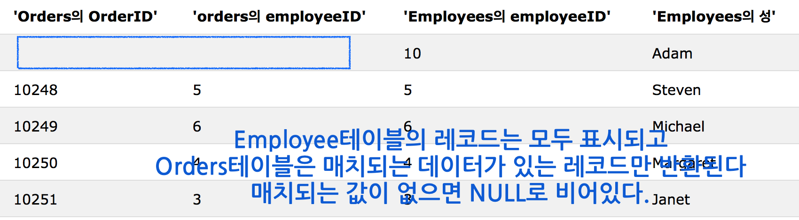

# SQL Tutorial 02

## SQL Joins
여러 테이블의 행을 합칠 때 사용한다. join 조건이 맞으면 동일한 필드가 있는 여러 테이블의 모든 행을 합쳐서 반환해준다. 

### 종류
가장 일반적으로 쓰이는 것은 INNER JOIN이다.

* INNER JOIN: Returns all rows when there is at least one match in BOTH tables
* LEFT JOIN: Return all rows from the left table, and the matched rows from the right table
* RIGHT JOIN: Return all rows from the right table, and the matched rows from the left table
* FULL JOIN: Return all rows when there is a match in ONE of the tables

## INNER JOIN
양 테이블의 컬럼이 같을때 모든 행을 반환한다. (두 테이블이 모두 겹치는 부분이 있는 레코드들만 반환된다.)


### 실행문
```
SELECT column_name(s)
FROM table1
JOIN table2
ON table1.column_name=table2.column_name;
```
**INNER JOIN 대신 JOIN으로 표기해주어도 같다.**

### 실행 예
```
SELECT Customers.CustomerName, Orders.OrderID
FROM Customers
INNER JOIN Orders
ON Customers.CustomerID=Orders.CustomerID
ORDER BY Customers.CustomerName;
```
customer테이블의 customerID컬럼과 orders테이블의 customerID컬럼은 같은 내용이므로 둘을 기준으로 맞춰서 두 테이블을 합치고, customerName을 기준으로 오름차순 정렬한 뒤에 customerName컬럼과 orderID 컬럼만 보여준다.   

## LEFT JOIN
왼쪽 테이블을 기준으로 join해서 왼쪽 테이블의 레코드는 모두 보여주지만, 오른쪽 테이블은 왼쪽 테이블과 join할때 매치되는 데이터가 있는 레코드만 보여준다. join으로 반환된 결과에서 왼쪽 테이블과 매치된 결과가 없는 오른쪽 테이블 부분은 NULL값으로 나온다.


 

### 실행문
```
SELECT Customers.CustomerName, Customers.CustomerID as [customerid from c], Orders.CustomerID as [customerid from o], Orders.OrderID
FROM Customers
LEFT JOIN Orders
ON Customers.CustomerID=Orders.CustomerID
ORDER BY Customers.CustomerName;
```

**LEFT OUTER JOIN이라고 커맨드를 입력해야 하는 데이터베이스도 있다.**

## RIGHT JOIN
반대로 오른쪽 테이블의 레코드를 전부 보여주고 왼쪽 테이블은 오른쪽 테이블과 매치된 데이터가 있는 레코드만 반환해준다. 


### 실행문
```
SELECT Orders.OrderID, Employees.FirstName
FROM Orders
RIGHT JOIN Employees
ON Orders.EmployeeID=Employees.EmployeeID
ORDER BY Orders.OrderID;
```
**마찬가지로 어떤 데이터베이스는 RIGHT OUTER JOIN으로 입력해야 한다.**



## FULL OUTER JOIN
지금까지의 join들은 매치되는 데이터가 필요했다. full outer join은 매치되는 데이터와 상관없이 양쪽 테이블의 레코드를 전부 반환해준다. 


### 실행문
```
SELECT Customers.CustomerName, Orders.OrderID
FROM Customers
FULL OUTER JOIN Orders
ON Customers.CustomerID=Orders.CustomerID
ORDER BY Customers.CustomerName;
```


## UNION
여러개의 셀렉트한 컬럼 결과값들을 합쳐준다. (수직방향으로 붙여준다.)

### 실행문
```
SELECT column_name(s) FROM table1
UNION
SELECT column_name(s) FROM table2;
```
union하기 위한 컬럼의 갯수는 각각 같아야 하고 데이터 타입도 비슷해야 한다. 또한 union하기 위해 select한 컬럼들도 실행문에서 같은 순서로 써줘야 한다. 

**union한 결과는 중복데이터는 허용하지 않는다. 중복 데이터를 전부 나타내려면 ALL 키워드를 사용해야 한다.**

### UNION ALL
```
SELECT City FROM Customers
UNION ALL
SELECT City FROM Suppliers
ORDER BY City;
```
중복된 데이터도 상관없이 양쪽 테이블의 값을 모두 나타내준다. 중복값도 나타나서 UNION했을 때보다 같거나 많은 레코드가 나타난다.

### UNION ALL WHERE
```
SELECT City, Country FROM Customers
WHERE Country='Germany'
UNION ALL
SELECT City, Country FROM Suppliers
WHERE Country='Germany'
ORDER BY City;
```
WHERE절을 붙여서 같이 쓸 수 있다.


## SELECT INTO
한 테이블의 데이터를 일부 가져와 새로운 테이블로 만들 수 있다. 

### 실행문 
```
SELECT column_name(s)
INTO newtable [IN externaldb]
FROM table1;
```
실행문에 쓰여진 컬럼명으로 새로운 테이블에 생셩된다. **AS로 새로운 컬럼명을 줄 수도 있다.** 다른 데이터베이스로 넣을때는 IN을 써준다.

### 실행 예제
```
SELECT *
INTO CustomersBackup2013 IN 'Backup.mdb'
FROM Customers;
```
IN을 사용해 다른 데이터베이스로 복사할때

```
SELECT *
INTO CustomersBackup2013
FROM Customers
WHERE Country='Germany';
```
WHERE로 일부 값만 복사할 때

```
SELECT Customers.CustomerName, Orders.OrderID
INTO CustomersOrderBackup2013
FROM Customers
LEFT JOIN Orders
ON Customers.CustomerID=Orders.CustomerID;
```
여러 테이블의 값을 선택적으로 복사할 때

```
SELECT *
INTO newtable
FROM table1
WHERE 1=0;
```
WHERE절에 false조건을 줘서 비어있는 새 테이블을 만든다.


## INSERT INTO SELECT
한 테이블의 값을 복사해 기존의 다른 테이블에 삽입한다. 기존의 테이블의 레코드는 영향을 받지 않는다. 기존테이블 레코드의 아래로 삽입된다. 

### 실행문 
```
INSERT INTO Customers (CustomerName, Country)
SELECT SupplierName, Country FROM Suppliers;
```
### 실행결과


suppliers테이블의 supplierName, country컬럼을 customers 테이블의 customerName, country컬럼에 삽입한다. 


