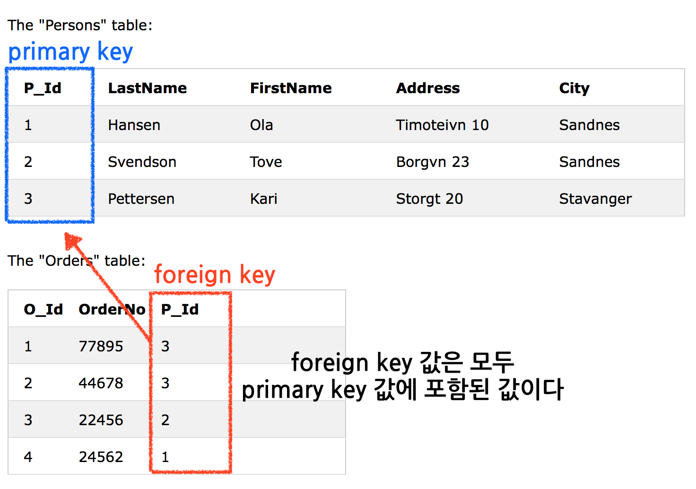

# SQL Tutorial 03

## CREATE DATABASE
새로운 데이터베이스를 만든다.

### 실행문 
`
CREATE DATABASE dbname;
`

## CREATE TABLE
새로운 테이블을 만든다. 반드시 테이블에는 이름이 있어야 한다.

```
CREATE TABLE table_name
(
column_name1 data_type(size),
column_name2 data_type(size),
column_name3 data_type(size),
....
);
```
* data type의 종류
	* varchar - 문자형
	* integer - 정수형
	* decimal - 실수형
	* date - 날짜형
	* 기타


### 실행문  	
```sql
CREATE TABLE Persons
(
PersonID int,
LastName varchar(255),
FirstName varchar(255),
Address varchar(255),
City varchar(255)
);
```
(255)는 데이터의 크기를 나타낸다. 255자까지 들어갈 수 있다. 만들어진 테이블에는 INSERT INTO로 데이터를 채운다.

## Constraints
테이블에 삽입하는 데이터에 제약조건을 걸어준다. 제약조건은 테이블을 생성할 때 (CREATE TABLE실행문 안에서) 걸어주거나, 생성된 테이블에 (ALTER TABLE실행문으로 ) 걸어줄 수 있다. 

### 실행문 
```
CREATE TABLE table_name
(
column_name1 data_type(size) constraint_name,
column_name2 data_type(size) constraint_name,
column_name3 data_type(size) constraint_name,
....
);
```

### 제약조건의 종류
* NOT NULL - NULL값을 담을 수 없다. (반드시 데이터가 채워져야 한다.)
* UNIQUE - 컬럼의 각 row의 값이 반드시 고유한 값을 가져야 한다.
* PRIMARY KEY - NULL값이 아니며 동시에 고유한 값을 가져야 한다. 이 컬럼은 고유한 정체성을 가지며, 특정 레코드를 쉽고 빠르게 찾을 수 있게 해준다. 
* FOREIGN KEY - 한 테이블과 다른 테이블에 서로 일치하는 데이터가 있어서 참조하는 관계일때 참조무결성을 보장해준다. 
* CHECK - 컬럼값이 특정조건을 가진다. 
* DEFAULT - 특정 기본값을 가진다.

## NOT NULL Constraint
컬럼이 항상 NULL이 아닌 값을 갖도록 강제한다. **한 컬럼이 이 제약조건을 가지면 이 컬럼값을 넣어주지 않는 한 새로운 레코드를 insert하거나 update할 수 없다. ** 

## UNIQUE Constraint
이 제약조건은 각 레코드를 고유하게 식별할 수 있게 해준다. unique와 primary key모두 컬럼의 독자성을 보장한다. 그러나 **한 테이블에 unique 제약조건은 여러개 둘 수 있지만 primary key는 한개만 둘 수 있다.**

### 테이블 생성시 실행문 
* SQL Server / Oracle / MS Access:

```
CREATE TABLE Persons
(
P_Id int NOT NULL UNIQUE,
LastName varchar(255) NOT NULL,
FirstName varchar(255),
Address varchar(255),
City varchar(255)
)
```

* MySQL:


```
CREATE TABLE Persons
(
P_Id int NOT NULL,
LastName varchar(255) NOT NULL,
FirstName varchar(255),
Address varchar(255),
City varchar(255),
UNIQUE (P_Id)
)
```

### 여러 칼럼 조합에 unique조건을 주기

```
CREATE TABLE Persons
(
P_Id int NOT NULL,
LastName varchar(255) NOT NULL,
FirstName varchar(255),
Address varchar(255),
City varchar(255),
CONSTRAINT uc_PersonID UNIQUE (P_Id,LastName)
)
```
제약조건에 이름(uc_PersonID)을 붙일 수 있다. 이 경우 여러 칼럼의 조합으로 생긴 unique조건이어서 **한 컬럼내의 데이터 고유성을 보장하는 것이 아니라, 컬럼 조합의 데이터 고유성을 보장한다.** 즉, P_Id 와 LastName 의 조합이 고유해야 한다. 예를들어 (1, kim) 과 (1, Lee)는 P_Id칼럼내의 값이 동일하지만 조합은 서로 다르기 때문에 허용된다. 

### 테이블 생성후에 제약조건 걸기
```
ALTER TABLE Persons
ADD UNIQUE (P_Id)
```

여러 컬럼 조합에 제약을 거는 방법은 다음과 같다.

```
ALTER TABLE Persons
ADD CONSTRAINT uc_PersonID UNIQUE (P_Id,LastName)
```

### 제약조건의 삭제 
* MySQL:


```
ALTER TABLE Persons
DROP INDEX uc_PersonID
```

* SQL Server / Oracle / MS Access:

```
ALTER TABLE Persons
DROP CONSTRAINT uc_PersonID
```

## PRIMARY KEY Constraint
이 제약조건은 반드시 unique값을 가져야 한다. (즉, 이 제약조건이 걸린 컬럼은 당연히 unique제약조건도 갖는다.) 그리고 NULL값을 갖을 수 없다. 대부분의 테이블은 primary key를 가져야 하며 테이블당 하나씩만 가질 수 있다. 

### 테이블 생성시 
* MySQL:

```
CREATE TABLE Persons
(
P_Id int NOT NULL,
LastName varchar(255) NOT NULL,
FirstName varchar(255),
Address varchar(255),
City varchar(255),
PRIMARY KEY (P_Id)
)
```

* SQL Server / Oracle / MS Access:

```
CREATE TABLE Persons
(
P_Id int NOT NULL PRIMARY KEY,
LastName varchar(255) NOT NULL,
FirstName varchar(255),
Address varchar(255),
City varchar(255)
)
```

### 여러 컬럼 조합을 primary key값으로 설정하기 
```
CREATE TABLE Persons
(
P_Id int NOT NULL,
LastName varchar(255) NOT NULL,
FirstName varchar(255),
Address varchar(255),
City varchar(255),
CONSTRAINT pk_PersonID PRIMARY KEY (P_Id,LastName)
)
```
하나의 primary key가 두개의 컬럼의 조합을 값으로 갖는다. 

### 생성된 테이블에 제약걸기 
```
ALTER TABLE Persons
ADD PRIMARY KEY (P_Id)
```

* 여러 컬럼 조합을 키값으로 갖게할 경우

```
ALTER TABLE Persons
ADD CONSTRAINT pk_PersonID PRIMARY KEY (P_Id,LastName)
```
**테이블이 처음 만들어졌을때 ALTER로 primary key제약을 걸려고 한다면, 제약을 걸기위한 컬럼은 NULL값을 허용하지 않도록 되어있어야 한다.**

### 제약조건 삭제하기 
* MySQL:

```
ALTER TABLE Persons
DROP PRIMARY KEY
```

* SQL Server / Oracle / MS Access:

```
ALTER TABLE Persons
DROP CONSTRAINT pk_PersonID
```

## FOREIGN KEY Constraint


* foreign key는 참조하는 테이블의 primary key를 가리킨다.
* foreign key 제약은 두 테이블 간의 연결이 깨지는 것을 방지한다.
* 무효한 데이터가 foreign key제약이 걸린 컬럼에 삽입되는 것을 막는다. 
* 왜냐하면 foregin key제약이 걸린 컬럼의 값은 foreign key가 가리키는 테이블의 primary key컬럼에 포함된 값이어야 한다. 

### 테이블 생성시 
* MySQL:

```sql
CREATE TABLE Orders
(
O_Id int NOT NULL,
OrderNo int NOT NULL,
P_Id int,
PRIMARY KEY (O_Id),
FOREIGN KEY (P_Id) REFERENCES Persons(P_Id)
)
```

* SQL Server / Oracle / MS Access:

```sql
CREATE TABLE Orders
(
O_Id int NOT NULL PRIMARY KEY,
OrderNo int NOT NULL,
P_Id int FOREIGN KEY REFERENCES Persons(P_Id)
)
```
orders 테이블에는 primary key(O_Id) 와 foreign key(P_Id)가 있고, persons테이블의 primary key(P_Id)를 참조한다.

### 이름붙여서 foreign key만들기 
```sql
CREATE TABLE Orders
(
O_Id int NOT NULL,
OrderNo int NOT NULL,
P_Id int,
PRIMARY KEY (O_Id),
CONSTRAINT fk_PerOrders FOREIGN KEY (P_Id)
REFERENCES Persons(P_Id)
)  
```

### 생성된 테이블에 제약걸기 
```sql
ALTER TABLE Orders
ADD FOREIGN KEY (P_Id)
REFERENCES Persons(P_Id)
```

* 이름붙여서 만들기 

```sql
ALTER TABLE Orders
ADD CONSTRAINT fk_PerOrders
FOREIGN KEY (P_Id)
REFERENCES Persons(P_Id)
```

### 제약조건 삭제하기 
* MySQL:

```sql
ALTER TABLE Orders
DROP FOREIGN KEY fk_PerOrders
```

* SQL Server / Oracle / MS Access:

```sql
ALTER TABLE Orders
DROP CONSTRAINT fk_PerOrders
```

##  CHECK Constraint

컬럼에 입력될 수 있는 값의 범위를 한정한다. 한 컬럼에만 제약을 걸어서 컬럼값의 범위를 정할 수 있다. 테이블 수준에서 제약을 걸어서 여러 컬럼의 값을 제한할 수 있다.

### 테이블 생성시 
P_Id 컬럼에 0보다 큰 정수만 입력되게 조건을 걸었다. 

* MySQL:

```sql
CREATE TABLE Persons
(
P_Id int NOT NULL,
LastName varchar(255) NOT NULL,
FirstName varchar(255),
Address varchar(255),
City varchar(255),
CHECK (P_Id>0)
)
```

* SQL Server / Oracle / MS Access:

```sql
CREATE TABLE Persons
(
P_Id int NOT NULL CHECK (P_Id>0),
LastName varchar(255) NOT NULL,
FirstName varchar(255),
Address varchar(255),
City varchar(255)
)
```

### 여러개의 컬럼에 제약걸기
```sql
CREATE TABLE Persons
(
P_Id int NOT NULL,
LastName varchar(255) NOT NULL,
FirstName varchar(255),
Address varchar(255),
City varchar(255),
CONSTRAINT chk_Person CHECK (P_Id>0 AND City='Sandnes')
)
```

### 생성된 테이블에기제약걸기
```sql
ALTER TABLE Persons
ADD CHECK (P_Id>0)
```

* 여러컬럼에 제약걸기

```sql
ALTER TABLE Persons
ADD CONSTRAINT chk_Person CHECK (P_Id>0 AND City='Sandnes')
```

### 제약조건 삭제하기
* SQL Server / Oracle / MS Access:

```sql
ALTER TABLE Persons
DROP CONSTRAINT chk_Person
```

* MySQL:

```sql
ALTER TABLE Persons
DROP CHECK chk_Person
```

## DEFAULT Constraint

특정한 값이 입력되지 않으면 컬럼에 기본값을 넣어준다. 

### 테이블 생성시 
city칼럼에 값이 입력되지 않으면 Sandnes를 입력해준다.
```sql
CREATE TABLE Persons
(
P_Id int NOT NULL,
LastName varchar(255) NOT NULL,
FirstName varchar(255),
Address varchar(255),
City varchar(255) DEFAULT 'Sandnes'
)
```

* GETDATE()와 같은 함수를 사용해 시스템 값을 기본값으로 사용할 수 있다. (입력되는 시점의 시스템의 날짜값을 대신 입력해준다.)


```sql
CREATE TABLE Orders
(
O_Id int NOT NULL,
OrderNo int NOT NULL,
P_Id int,
OrderDate date DEFAULT GETDATE()
)
```

### 생성된 테이블에 제약걸기 
* MySQL:

```sql
ALTER TABLE Persons
ALTER City SET DEFAULT 'SANDNES'
```

* SQL Server / MS Access:

```sql
ALTER TABLE Persons
ALTER COLUMN City SET DEFAULT 'SANDNES'
```

* Oracle:

```sql
ALTER TABLE Persons
MODIFY City DEFAULT 'SANDNES'
```

### 제약조건 삭제하기 
* MySQL:

```sql
ALTER TABLE Persons
ALTER City DROP DEFAULT
```

* SQL Server / Oracle / MS Access:

```sql
ALTER TABLE Persons
ALTER COLUMN City DROP DEFAULT
```

## CREATE INDEX 
테이블에 인덱스를 생성해준다. 인덱스가 있으면 데이터베이스 관리 앱이 데이터 베이스 전체를 읽지 않고 빠르게 데이터를 찾을 수 있다. 

### 인덱스 
데이터를 빠르고 효과적으로 찾기위해 테이블에 생성된다. 보이지는 않지만 빠르게 검색할 때 사용한다. 
**단, 인덱스가 있으면 테이블 업데이트 시간이 더 걸린다. 그래서 자주쓰는 컬럼이나 테이블에 만들어야 한다. **

### 생성하기 
#### CREATE INDEX
인덱스를 사용한 컬럼에 중복값이 허용된다.
```sql
CREATE INDEX index_name
ON table_name (column_name)
```

#### SQL CREATE UNIQUE INDEX
인덱스를 사용한 컬럼에 중복값이 허용되지 않는다.
```sql
CREATE UNIQUE INDEX index_name
ON table_name (column_name)
```

## DROP
인덱스와 테이블과 데이터베이스를 지울 수 있다.

### DROP INDEX 
인덱스 지우기

*  MS Access:

```sql
DROP INDEX index_name ON table_name
```

*  MS SQL Server:

```sql
DROP INDEX table_name.index_name
```

*  DB2/Oracle:

```sql
DROP INDEX index_name
```

*  MySQL:

```sql
ALTER TABLE table_name DROP INDEX index_name
```

### DROP TABLE
테이블 지우기

```sql
DROP TABLE table_name
```			
### DROP DATABASE
데이터베이스 제거하기

```sql
DROP DATABASE database_name
```

### TRUNCATE TABLE
테이블 안의 데이터만 지우기

```sql
TRUNCATE TABLE table_name
```

## ALTER TABLE
테이블을 추가하고, 지우고, 기존 테이블의 컬럼을 변형한다.

