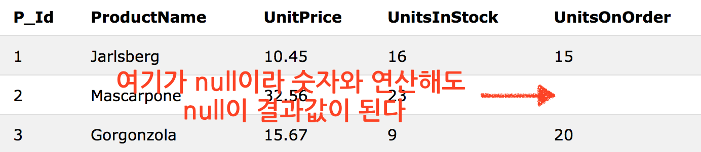

# SQL Tutorial 04

## Views
뷰는 SQL실행 결과에 기반한 가상 테이블이다. 

>여러 테이블이나 또다른 뷰에서 데이터를 선택해, 사용자 정의해서 나타낼 수 있다.
>
>뷰는 기본 테이블(table)과 같이 행(column)과 열(row)로 구성되지만, 다른 테이블에 있는 데이터를 보여줄 뿐이며, 실제 테이블과 달리 데이터 자체를 포함하고 있는 것은 아니다. 뷰를 사용하면 여러 테이블이나 뷰를 하나의 테이블인 것처럼 볼 수 있다.


>[위키백과 - VIEW](https://ko.wikipedia.org/wiki/VIEW_(SQL)) 

### 뷰 생성하기
```sql
CREATE VIEW view_name AS
SELECT column_name(s)
FROM table_name
WHERE condition
```
**뷰는 항상 최신 데이터를 보여준다. 데이터베이스 엔진은 뷰를 쿼리할때마다 다시 데이터를 생성한다.**

### 뷰 생성 예제 
```sql
CREATE VIEW [Current Product List] AS
SELECT ProductID,ProductName
FROM Products
WHERE Discontinued=No
```
위와 같이 다른 테이블의 데이터로 `[Current Product List]`라는 뷰를 만들었다. 다음과 같이 쿼리할 수 있다.

```sql
SELECT * FROM [Current Product List]
```

WHERE절에 함수를 추가해서 생성할 수도 있다. 
```sql 
CREATE VIEW [Products Above Average Price] AS
SELECT ProductName,UnitPrice
FROM Products
WHERE UnitPrice>(SELECT AVG(UnitPrice) FROM Products)
```

다른 뷰를 이용해 새로운 뷰를 만들었다.
```sql
CREATE VIEW [Category Sales For 1997] AS
SELECT DISTINCT CategoryName,Sum(ProductSales) AS CategorySales
FROM [Product Sales for 1997]
GROUP BY CategoryName
```

### 뷰 갱신하기 
#### CREATE OR REPLACE VIEW
```sql
CREATE OR REPLACE VIEW view_name AS
SELECT column_name(s)
FROM table_name
WHERE condition
```

다음과 같이 뷰에 컬럼을 추가할 수 있다. 
```sql 
CREATE OR REPLACE VIEW [Current Product List] AS
SELECT ProductID,ProductName,Category
FROM Products
WHERE Discontinued=No
```
생셩될 때 ProductID,ProductName 컬럼만 있던 뷰에 Category컬럼을 추가했다.

### 뷰 삭제하기 
```sql
DROP VIEW view_name
```

## Date Functions
>날짜 데이터를 다룰때 가장 어려운 점은 입력하려는 날짜 데이터 형식과 데이터베이스 컬럼에 있는 날짜 데이터 형식을 맞춰주는 일이다. 

시간 데이터를 다룰 때 쿼리 실행을 간단하고 쉽게 하려면, 데이터 포맷 형식을 너무 자세하지 않게 하는게 좋다!
> 나쁜예 
> `SELECT * FROM Orders WHERE OrderDate='2008-11-11 11:12:01'`
> 


### 내장 함수의 종류 
#### MySQL Date Functions

|함수   |표시형식   |설명   |
|---|---|---|
| NOW()  |2014-11-22 12:45:34|현재 날짜와 시각을 반환| 
| CURDATE()	  |2014-11-22|현재 날짜를 반환| 
|CURTIME()|12:45:34|현재 시각을 반환| 
| DATE()	|2014-11-22|날짜/시각 표현에서 날짜만 추출| 
|EXTRACT()|   |날짜/시각, 년,월,일,시,분 등 한 부분만 반환| 
|DATE_ADD()|   |date데이터에 특정 시간을 추가   |
|DATE_SUB()|   |date데이터에서 특정 시간을 앞당김  |
|DATEDIFF()|   |두 date사이의 차이를 반환   |
|DATE_FORMAT()|   |보여지는 형식을 바꿔준다   |

>date 데이터 형식의 종류
>
* MICROSECOND
* SECOND
* MINUTE
* HOUR
* DAY
* WEEK
* MONTH
* QUARTER
* YEAR
* SECOND_MICROSECOND
* MINUTE_MICROSECOND
* MINUTE_SECOND
* HOUR_MICROSECOND
* HOUR_SECOND
* HOUR_MINUTE
* DAY_MICROSECOND
* DAY_SECOND
* DAY_MINUTE
* DAY_HOUR
* YEAR_MONTH


#### SQL Server Date Functions
|함수|표시형식   |설명   |
|---|---|---|
| GETDATE()  |2014-11-22 12:45:34.243|현재 날짜와 시각 반환|
|DATEPART()|   |날짜/시각, 년,월,일,시,분 등 한 부분만 반환|
|DATEADD()|   |date데이터에 특정 시간을 추가|
|  DATEDIFF()	 |   |두 date사이의 차이를 반환 |
|CONVERT()|   |다른 형식으로 보여준다|

### SQL Date Data Types
#### MySQL:

* DATE - format YYYY-MM-DD
* DATETIME - format: YYYY-MM-DD HH:MI:SS
* TIMESTAMP - format: YYYY-MM-DD HH:MI:SS
* YEAR - format YYYY or YY

#### SQL Server:

* DATE - format YYYY-MM-DD
* DATETIME - format: YYYY-MM-DD HH:MI:SS
* SMALLDATETIME - format: YYYY-MM-DD HH:MI:SS
* TIMESTAMP - format: a unique number


## NULL Values
null값은 결여되어 다룰 수 없는 데이터이다. 컬럼은 기본적으로 널값을 가질 수 있다. 

임의로 존재하는 컬럼이라면, 이 컬럼에는 값을 입력하지 않고 레코드를 추가하거나 수정할 수 있다. 그러면 이 컬럼에는 NULL값이 저장된다. NULL값은 다른 데이터와 다르게 취급된다. **예를들어 0과 NULL값은 비교가 불가능하다. 이 둘은 동등한 데이터로 취급되지 않는다.**

### NULL값 다루기 
NULL값은 다른 데이터와 비교연산이 불가능하다. 예를들어 `=`,`<`,`<>`등을 사용할 수 없다. 대신 `IS NULL`,`IS NOT NULL`을 사용해야 한다.

### IS NULL
NULL값을 가진 레코드를 선택할 때 사용한다. (null값을 가진 레코드 찾을때는 **항상** 사용한다.)

```sql
SELECT LastName,FirstName,Address FROM Persons
WHERE Address IS NULL
```


### IS NOT NULL
null값을 안가진 레코드를 찾을때는 이것을 사용한다.

```sql
SELECT LastName,FirstName,Address FROM Persons
WHERE Address IS NOT NULL
```

## NULL Functions

### NULL값을 숫자와 연산하게 하는 함수

```sql
SELECT ProductName,UnitPrice*(UnitsInStock+UnitsOnOrder)
FROM Products
```

>셀렉 할때 컬럼끼리도 곱연산이 가능했다니!!!!!!!!! 

위와같은 쿼리를 실행할 때 unitsOnOrder에 null값이 있으면 제대로된 곱연산 결과값을 얻을 수 없는 문제가 있다.

이것은 null함수를 통해 null을 0으로 바꿔 연산하게 해줘서 해결할 수 있다.

#### MS Access : ISNULL()사용

```sql
SELECT ProductName,UnitPrice*(UnitsInStock+IIF(ISNULL(UnitsOnOrder),0,UnitsOnOrder))
FROM Products
```

#### SQL Server : ISNULL()사용

```sql
SELECT ProductName,UnitPrice*(UnitsInStock+ISNULL(UnitsOnOrder,0))
FROM Products
```

#### Oracle : NVL()사용
오라클에는 ISNULL()이 없다.

```sql
SELECT ProductName,UnitPrice*(UnitsInStock+NVL(UnitsOnOrder,0))
FROM Products
```

#### MySQL : IFNULL()과 COALESCE()
mySQL도 ISNULL()이 없다.

* IFNULL()

```sql
SELECT ProductName,UnitPrice*(UnitsInStock+IFNULL(UnitsOnOrder,0))
FROM Products
```


* COALESCE()


```sql
SELECT ProductName,UnitPrice*(UnitsInStock+COALESCE(UnitsOnOrder,0))
FROM Products
```


## General Data Types

일반 데이터 타입은 컬럼에 담길 데이터 값의 종류를 결정한다. 각 컬럼은 만들어질때 이름과 데이터 형식이 정해져야 한다. 데이터 형식은 SQL이 어떤 종류의 데이터가 컬럼에 있는지 이해하는 지침이 되고, 저장된 데이터와 어떻게 상호작용할지 식별할 수 있게 해준다.

### 종류 
|데이터 형식|설명|
|---|---|
|CHARACTER(n)|고정 크기 문자열, n은 고정 크기|
|VARCHAR(n) or
CHARACTER VARYING(n)|가변 크기 문자열, n은 최대크기|
|BINARY(n)|이진 문자열, 고정크기 n|
|BOOLEAN|TRUE 나 FALSE|
|VARBINARY(n) or
BINARY VARYING(n)|이진 문자열, 가변크기로 최대길이 n|
|INTEGER(p)|정수, 자리수p|
|SMALLINT|정수, 자리수 5|
|INTEGER|정수, 자리수 10|
|BIGINT|정수, 자리수 19|
|DECIMAL(p,s)|소수, p는 유효숫자 갯수, s는 소수점 길이|
|NUMERIC(p,s)|DECIMAL이랑 같음|
|FLOAT(p)|부동(가변) 소수점, 유효숫자 p, 10을 지수로 표시한다|
|REAL|부동 소수점, 유효숫자 7|
|FLOAT|부동 소수점 수, 유효숫자 16|
|DOUBLE PRECISION|부동 소수점, 유효숫자 16   |
|DATE|년,월,일|
| TIME |시,분,초|
|TIMESTAMP|년,월,일,시,분,초|
|INTERVAL|시간을 정수형으로 나타낸다. 어떤 시각의 간격을 나타내는가에 타입이 정해진다.|
|ARRAY|고정크기에 순서가 있는 콜렉션|
|MULTISET|가변길이의 순서가 없는 콜렉션|
|XML|  XML데이터 |


### 데이터베이스 별 데이터 형식 참고

| 데이터형식  | Access | SQLServer | Oracle   | MySQL | PostgreSQL |
|:---:|:---:|:---:|:---:|:---:|:---:|
| boolean |Yes/No|Bit|Byte|N/A| Boolean |
| integer |Number (integer)| Int | Number | Int,Integer  |  Int,Integer |
| float |Number (single)|  Float,Real | Number | Float |  Numeric |
| currency | Currency |  Money |N/A|N/A| Money |
|string (fixed)|N/A| Char | Char | Char | Char |
|string (variable)|Text (<256),Memo (65k+)| Varchar |Varchar, Varchar2| Varchar | Varchar |
|binary object|OLE Object Memo|Binary (fixed up to 8K), Varbinary (<8K), Image (<2GB)|Long, Raw|   Blob, Text|Binary, Varbinary|

**데이터 형식 이름이 같아도 데이터베이스 별로 데이터 형식 크기나 다른 사항이 다를 수 있으니 항상 주의하시오!**


## 다양한 DB의 Data Types

HAㅏ... 나중에..

## Comments
주석을 달면 실행문의 영역을 나누기 좋다! 테스팅할때도 전부 실행하는것을 막기에 좋다!

>MS Access 데이터베이스는 주석을 지원하지 않는다. 

### 한줄 주석
`--`를 사용한다.

```sql
--SELECT * FROM Customers;
SELECT * FROM Products;
```
이렇게!


### 여러줄 주석 
`/* 주석 */` 이렇게 한다. 물론 실행문 안에도 가능하다. 

```sql
SELECT * FROM Customers WHERE (CustomerName LIKE 'L%'
OR CustomerName LIKE 'R%' /*OR CustomerName LIKE 'S%'
OR CustomerName LIKE 'T%'*/ OR CustomerName LIKE 'W%')
AND Country='USA'
ORDER BY CustomerName;
```