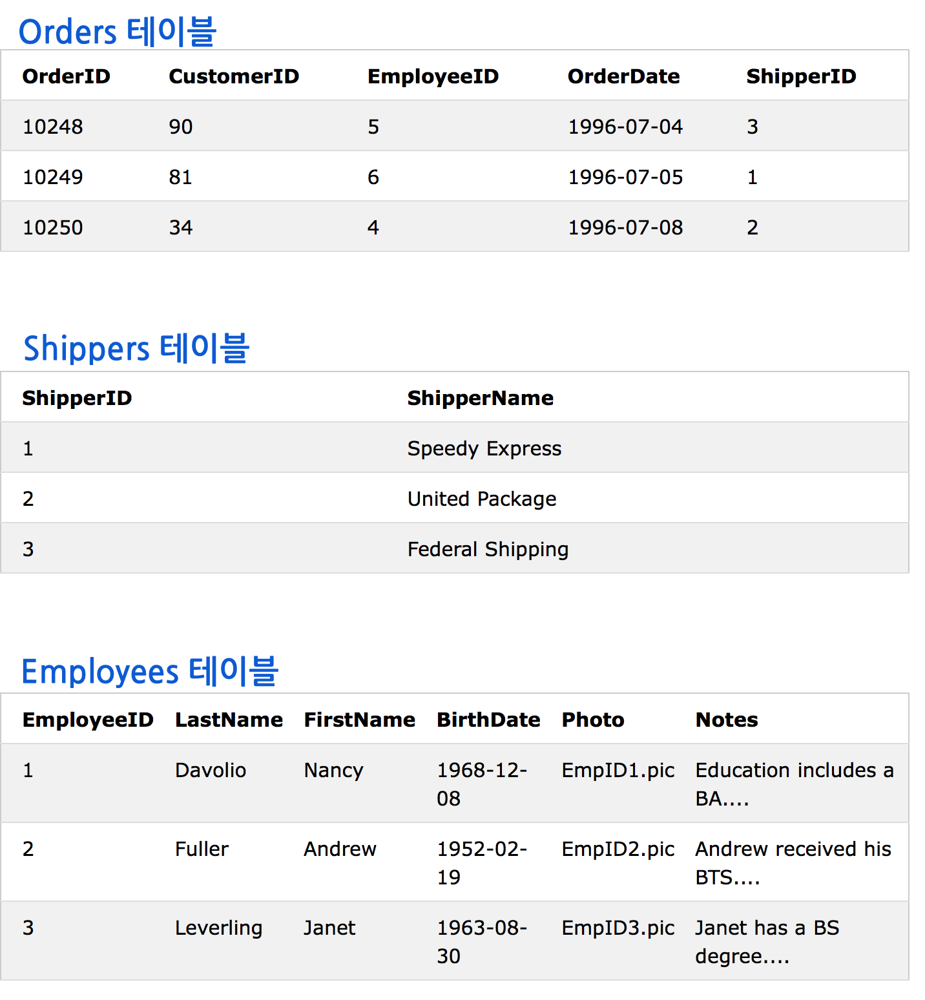
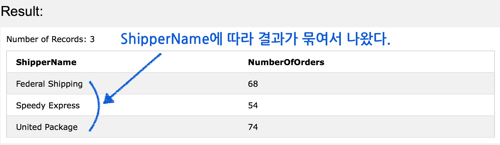
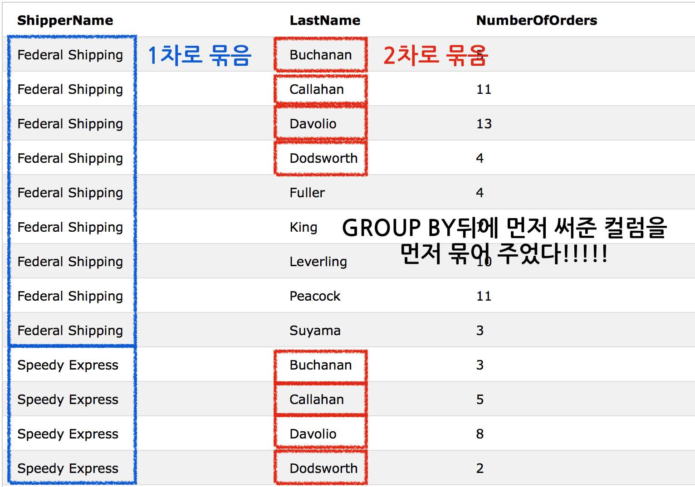
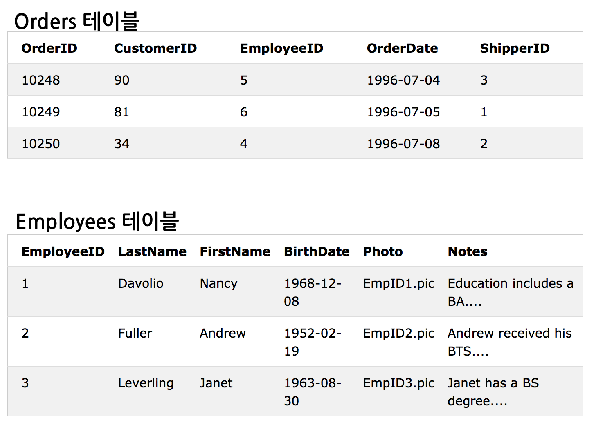
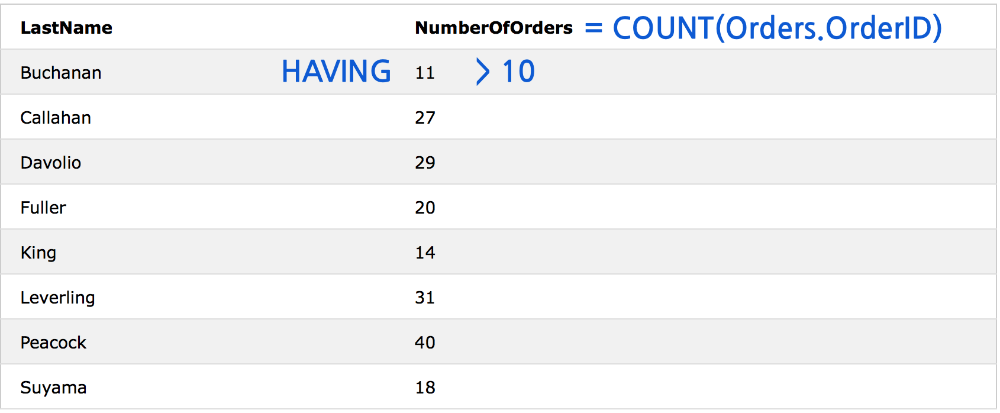

# SQL Functions

## 종류
SQL에는 계산을 위한 여러 내장함수들이 있다.

### SQL Aggregate Functions
집계함수는 컬럼값들을 통해 계산된 단일값을 반환해준다. 아래는 유용한 집계함수들이다.
 
* AVG() - 컬럼값의 평균 반환
* COUNT() - 컬럼에서 줄의 갯수 반환
* FIRST() - 컬럼의 가장 맨앞에 있는 값
* LAST() - 가장 나중 값
* MAX() - 가장 큰 값
* MIN() - 가장 작은 값
* SUM() - 값의 합계


### SQL Scalar functions
입력값을 기반으로 연산한 결과를 반환해준다. 아래는 유용한 함수들 몇가지다.

* UCASE() - 영역의 값을 대문자로 바꿔준다.
* LCASE() - 소문자로 바꿔준다.
* MID() - 문자들을 추출해준다.
* LEN() - 문자열의 크기를 반환해준다.
* ROUND() - 소수점 아래 갯수를 지정해서 반올림해 보여준다.
* NOW() - 시스템의 현재 시각을 알려준다.
* FORMAT() - 영역이 어떤 형식으로 되어있는지 알려준다. 

## AVG() Function
숫자형 컬럼의 평균값을 반환해준다.

### 구문 
```sql
SELECT AVG(column_name) FROM table_name
```

### 예제 
예제테이블이다.
table.png)

아래처럼 쿼리를 실행시키면,
```sql
SELECT AVG(Price) AS PriceAverage FROM Products;
```
result01.png)

AVG()를 WHERE절에 이용할 수도 있다. 

```sql
SELECT ProductName, Price FROM Products
WHERE Price>(SELECT AVG(Price) FROM Products);
```

result02.png)

## COUNT() Function
특정 조건에 맞는 줄의 수를 반환해준다. 

### COUNT(column_name) 
특정조건에 맞는 줄의 수를 세준다.
**NULL값은 카운트되지 않는다.**

```sql
SELECT COUNT(column_name) FROM table_name;
```

### COUNT(*)
null도 포함한다. 
```sql
SELECT COUNT(*) FROM table_name;
```
테이블의 row수를 다 세준다.

### COUNT(DISTINCT column_name) 
중복은 제외하고 카운트해준다. 오라클과 MS-SQL Server는 지원하지만 MS-Access는 지원하지 않는다.

```sql
SELECT COUNT(DISTINCT column_name) FROM table_name;
```

## FIRST() Function
선택된 컬럼의 첫번째 값을 반환해준다. 

### MS Access : FIRST()
```sql
SELECT FIRST(column_name) FROM table_name;
```
MS Access에서만 지원되는 함수였다....

### SQL Server :
```sql
SELECT TOP 1 column_name FROM table_name
ORDER BY column_name ASC;
```
컬럼을 오름차순 정렬하고 맨위 첫번째값을 셀렉한다.

### MySQL :
```sql
SELECT column_name FROM table_name
ORDER BY column_name ASC
LIMIT 1;
```
오름차순 정렬하고 limit로 시작점을 1로 정해 반환값을 하나로 제한을 둔다.

### Oracle :
```sql
SELECT column_name FROM table_name
WHERE ROWNUM <=1
ORDER BY column_name ASC;
```
오름차순 정렬하고 rownum번호가 1이하인것만 선택한다. 

## LAST() Function
FIRST()와 반대로 마지막 값을 반환해준다.

### MS Access :
```sql
SELECT LAST(column_name) FROM table_name;
```
역시 이것도 다른 데이터베이스에서는 지원이 안된다....

### SQL Server :
```sql
SELECT TOP 1 column_name FROM table_name
ORDER BY column_name DESC;
```
이번에는 내림차순 정렬을 하고 맨 위에 값을 한개만 선택한다.

### MySQL Syntax
```sql
SELECT column_name FROM table_name
ORDER BY column_name DESC
LIMIT 1;
```
역시 내림차순 정렬후에 값 선택을 맨 처음꺼만 하도록 limit를 사용한다.

### Oracle Syntax
```sql
SELECT column_name FROM table_name
ORDER BY column_name DESC
WHERE ROWNUM <=1;
```
역순 정렬후에 rownum이 1이하인것만, 즉 맨 첫번째꺼 하나만 선택한다.

## MAX() Function
선택된 컬럼의 최대값을 반환해준다.

### 구문 
```sql
SELECT MAX(column_name) FROM table_name;
```

## MIN() Function
선택된 컬럼에서 최소값을 반환해준다.

### 구문 
```sql
SELECT MIN(column_name) FROM table_name;
```

## SUM() Function
컬럼값의 총합을 계산해준다.

### 구문 
```sql
SELECT SUM(column_name) FROM table_name;
```

## GROUP BY
집계함수는 종종 그룹바이가 필요해요. 여러 컬럼의 결과와 집계함수를 연결시켜 준다. 예제를 보면 이해가 빠를듯.

### 구문 
```sql
SELECT column_name, aggregate_function(column_name)
FROM table_name
WHERE column_name operator value
GROUP BY column_name;
```
이렇게 맨뒤에 써준다.


### 예제 
다음과 같은 세 테이블이 있다.


먼저 이 쿼리를 실행시켜보면,

```sql
SELECT Shippers.ShipperName,COUNT(Orders.OrderID) AS NumberOfOrders FROM Orders
LEFT JOIN Shippers
ON Orders.ShipperID=Shippers.ShipperID
GROUP BY ShipperName;
```
orders와 shipper를 shipperID기준으로 레프트 조인하고, shipperName을 기준으로 묶어서 셀렉트한 결과를 보여준다.
결과는 다음과 같다.



#### 여러개로 묶어보기 
이때의 실행문 예제는 다음과 같다.

```sql
SELECT Shippers.ShipperName, Employees.LastName, COUNT(Orders.OrderID) AS NumberOfOrders
FROM ((Orders
INNER JOIN Shippers
ON Orders.ShipperID=Shippers.ShipperID)
INNER JOIN Employees
ON Orders.EmployeeID=Employees.EmployeeID)
GROUP BY ShipperName,LastName;
```
먼저 orders와 shippers를 이너조인한 것을 다시 employees와 이너조인한다. 그리고 shipperName을 기준으로 한번 묶고, 그안에서 LastName기준으로 다시 묶는다. 그 후 세개의 컬럼을 셀렉한다. 결과는 다음과 같다.



## HAVING Clause
WHERE절에서 집계함수를 못 쓰기 때문에 HAVING절을 사용해준다.

### 구문 
```sql
SELECT column_name, aggregate_function(column_name)
FROM table_name
WHERE column_name operator value
GROUP BY column_name
HAVING aggregate_function(column_name) operator value;
```        

### 예제 
우선 예제로 알아봅시다.
다음은 테이블들이다.


집계함수 COUNT()를 이용해 레코드를 선택하는 쿼리를 실행시켜본다.

```sql
SELECT Employees.LastName, COUNT(Orders.OrderID) AS NumberOfOrders FROM (Orders
INNER JOIN Employees
ON Orders.EmployeeID=Employees.EmployeeID)
GROUP BY LastName
HAVING COUNT(Orders.OrderID) > 10;
```
두 테이블을 이너조인하고 LastName으로 묶은 다음에 orderID갯수가 10보다 큰 레코드들 중에서 셀렉을 했다. 결과는 다음과 같다. 



다음처럼 WHERE와도 같이 쓸 수 있다.

```sql
SELECT Employees.LastName, COUNT(Orders.OrderID) AS NumberOfOrders FROM Orders
INNER JOIN Employees
ON Orders.EmployeeID=Employees.EmployeeID
WHERE LastName='Davolio' OR LastName='Fuller'
GROUP BY LastName
HAVING COUNT(Orders.OrderID) > 25;
```

## UCASE() Function
선택된 영역의 값이 전부 대문자로 변환된다.

### 구문 
```sql
SELECT UCASE(column_name) FROM table_name;
```

* SQL Server : 

```sql
SELECT UPPER(column_name) FROM table_name;
```

## LCASE() Function
선택된 영역의 값이 전부 소문자로 변환된다. 물론 영어만.

### 구문 
```sql
SELECT LCASE(column_name) FROM table_name;
```

* SQL Server :

```sql
SELECT LOWER(column_name) FROM table_name;
```

## MID() Function
문자를 추출해준다.

### 구문 
```sql
SELECT MID(column_name,start,length) AS some_name FROM table_name;
```

* SQL Server : SUBSTRING()

```sql
SELECT SUBSTRING(column_name,start,length) AS some_name FROM table_name;
```

* Oracle : SUBSTR():

```sql
SELECT SUBSTR(column_name,start,length) AS some_name FROM table_name;
```

**컬럼명, 시작점, 추출할 길이(이것은 선택사항)를 써줘야 한다.**

* 컬럼명 - 문자를 추출할 컬럼
* 시작점 - 추출하기 시작할 지점(문자열의 맨 앞은 1이다.)
* 길이 - 선택사항. 지정해주게 되면 이 길이만큼 추출해서 반환해준다. 생략하면 추출할 문자열의 끝까지 반환해준다. 


### 예제 
```sql
SELECT MID(customername,2,5) AS ShortName
FROM Customers;
```
customerName 컬럼의 2번째 문자에서 차례대로 5개의 문자를 반환하는 쿼리를 실행 (즉 2~6번째까지 문자를 반환)
result.png)


## The LEN() Function
문자열의 길이를 반환한다. 즉 문자의 갯수를 알려준다. 이때 공백도 한개의 문자로 친다!


### LEN() 구문
```sql
SELECT LEN(column_name) FROM table_name;
```
### Oracle : LENGTH()
```sql
SELECT LENGTH(column_name) FROM table_name;
```

### 예제 
다음과 같은 쿼리를 실행해보자.

```sql
SELECT CustomerName,LEN(Address) as LengthOfAddress
FROM Customers;
```

결과는 다음과 같이 공백과 마침표까지 포함해서 길이를 알려준다.

result.png)

